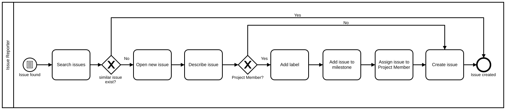

Table of Contents
=================

  * [Creating an issue](#creating-an-issue)
    * [Creating an issue in the repository that describe the bug if not already created](#creating-an-issue-in-the-repository-that-describe-the-bug-if-not-already-created)
    * [Adding labels to the issue](#adding-labels-to-the-issue)
    * [Adding a milestone to the issue (optional)](#adding-a-milestone-to-the-issue-optional)
    * [Assigning the issue to a sysadmin (optional)](#assigning-the-issue-to-a-sysadmin-optional)
    * [Closing an issue](#closing-an-issue)

# Creating an issue

## Work flow

## Creating an issue in the repository that describe the bug if not already created

The title should describe the issue, not the expected result, for example, "the
role does not support X", not "Support X". In general, it should be what it
should be, not what should be done. A bad example is, "Support platform X" and
a good example is, "The role does not support platform X". Describe the issue
you have, not the solution you want.

The comment body should describe:

* the issue in detail
* the expected result
* a possible action to be taken
* the version of role, ansible, and OS, when relevant
* include the way to reproduce the issue, if any

## Adding labels to the issue (optional, Project Members only)

Choose lables and add them to the issue. See
[Triaging_Issue](../Triaging_Issue) for label descriptions.

## Adding a milestone to the issue (optional, Project Members only)

If there is a planned milestone, such as the next release,
consider assigning the issue to it.

## Assigning the issue to a Project Member (optional, Project Member only)

If you are a Project Member, and going to fix the issue yourself,
assign the issue to you.

If you are a Project Member, and not going to fix the issue yourself, leave the
issue unassigned.

If you are a Project Member, you may assign the issue to a Project Member.
Before you do, discuss the issue with the Project Member.

If you are not a Project Member, leave the issue unassigned.

## Closing an issue

An issue can be closed when:

* The issue is resolved by a fix
* The issue has a label, `needs_feedback` and no feedback has been provided by
  the reporter within a month
* The issue is labeled as `invalid`
* The issue is a duplicate of another issue
* The issue has not been resolved within extensive period longer than six
  months without `pending` label

Close issues when one of the above conditions is met.
