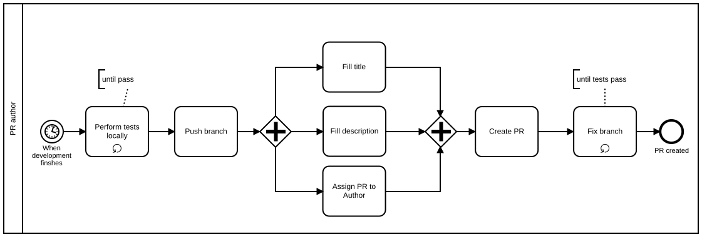

Table of Contents
Table of Contents
=================

  * [Table of Contents](#table-of-contents)
  * [Creating a pull request](#creating-a-pull-request)
    * [Overview](#overview)
    * [Before creating a PR](#before-creating-a-pr)
      * [Leaving comments](#leaving-comments)
      * [Performing all tests locally](#performing-all-tests-locally)
      * [Pushing the branch](#pushing-the-branch)
    * [Creating a PR](#creating-a-pr)
      * [Filling Title](#filling-title)
      * [Filling Description](#filling-description)
      * [Assigning the PR to author](#assigning-the-pr-to-author)
      * [Adding Tags (optional)](#adding-tags-optional)
      * [Adding Milestone (optional)](#adding-milestone-optional)
      * [Fixing the branch](#fixing-the-branch)
      * [Submit the PR](#submit-the-pr)
    * [Fixing or correcting the PR](#fixing-or-correcting-the-pr)
    * [Proceed to the next procedure](#proceed-to-the-next-procedure)

# Creating a pull request

When you create a PR, follow the procedures below.

## Overview



## Before creating a PR

You need to prepare for the PR before creating one.

### Leaving comments

When something should be fixed, but cannot be for the moment, leave a TODO
comment, create an Issue, and mention the comment in the Issue. See FIXME(the
document is being reviewed, see [the PR](https://github.com/reallyenglish/ansible-role-example/pull/108)).

###  Performing all tests locally

All tests should be tested in your local environment and pass the tests. The
tests includes `qansible qa`, `kitchen test` and the integration test. There
may exist valid reasons in particular circumstances where you cannot test
locally. It is strongly encouraged to follow this rule, or prepare your
justification.

### Pushing the branch

Push the branch to `origin`. When a branch has been pushed, github shows a
helpful notification at the top page of the repository.

## Creating a PR

Create a pull request. The official help is
available at [Creating a pull request](https://help.github.com/articles/creating-a-pull-request/).

### Filling Title

The title should be prefixed with the following tags.

| Tag | Description |
|-----|-------------|
| `[bugfix]` | The PR is a bug fix and backward compatible |
| `[feature]` | The PR implements new features, or improvements |
| `[backward incompatible`] | the PR is not backward compatible |
| `[documentation]` | The PR does not change the code, only documentation |

You may prefix the title with multiple tags.

These tag are used when releasing new version for two purposes; to decide the
next version number and to describe the new release in `CHANGELOG`. The title
will be the first line of commit log when merging with squash-and-merge.

The title may include the issue numbers that the PR fixes. Use parenthesis to
enclose the issue numbers.

Examples:

```
[bugfix] fix a compatibility issue (#X, #Y)
[feature] support Debian
[documentation] update README
[backward incompatible] make foo_bar a list, instead of a dict
[bugfix][backward incompatible] fix #Z, variable A is now a list, not a dict
```

Make sure that the branch has no conflicts with `master`.

### Filling Description

Describe the PR, and the issue you have solved. Add any references, such as issues, URLs, or commit logs. Use
[keywords to automatically close issues](https://help.github.com/articles/closing-issues-via-commit-messages/).

### Assigning the PR to author

Assign the PR to yourself.

### Adding Tags (optional)

Choose appropriate tags described in [Triaging_Issue](../Triaging_Issue).

### Adding Milestone (optional)

If you have a specific milestone that the PR should be included, assign the PR
to one.

### Submit the PR

Submit the PR by `Create pull request`.

### Fixing the branch

When all tests finish after creating the PR, make sure all the tests have
passed. Fix issues and tests by pushing the fixes to the remote branch until
all the tests pass.

## Proceed to the next procedure

Now you have successfully created a PR. Proceed to
[Asking Review and Getting Feedback](../Asking_Review_and_Getting_Feedback).
