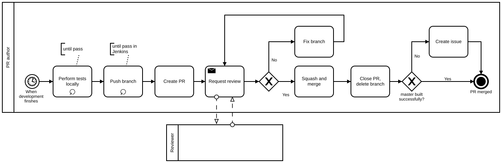

Table of Contents
=================

  * [Table of Contents](#table-of-contents)
  * [Creating a pull request](#creating-a-pull-request)
    * [Before creating a PR](#before-creating-a-pr)
      * [Performing all tests locally](#performing-all-tests-locally)
      * [Pushing the branch](#pushing-the-branch)
    * [Creating a PR](#creating-a-pr)
      * [Title](#title)
      * [Description](#description)
      * [Tags (optional)](#tags-optional)
      * [Milestone (optional)](#milestone-optional)
      * [Assignees](#assignees)
      * [Reviewers](#reviewers)
      * [Submit the PR](#submit-the-pr)
      * [Notifying the reviewers (optional)](#notifying-the-reviewers-optional)
    * [Fixing or correcting the PR](#fixing-or-correcting-the-pr)
    * [Merging](#merging)
    * [Closing the PR](#closing-the-pr)
    * [Making sure that the master branch is successfully built](#making-sure-that-the-master-branch-is-successfully-built)

# Creating a pull request

When you create a PR, follow the procedures below.

## Work flow



## Before creating a PR

You need to prepare for the PR before creating one.

###  Performing all tests locally

All tests should be tested in your local environment and pass the tests. The
tests includes `qansible qa`, `kitchen test` and the integration test.

### Pushing the branch

Push the branch to `origin`. Jenkins pulls the branch, tests it, and report the
test result in hipchat. Make sure that the result is successful. If not, fix
the branch and repeat.

## Creating a PR

After your branch passes the tests, create a pull request. The official help is
available at [Creating a pull request](https://help.github.com/articles/creating-a-pull-request/).

### Title

The title should be prefixed with the following tags.

| Tag | Description |
|-----|-------------|
| `[bugfix]` | The PR is a bug fix and backward compatible |
| `[feature]` | The PR implements new features, or improvements |
| `[backward incompatible`] | the PR is not backward compatible |
| `[documentation]` | The PR does not change the code, only documentation |

You may prefix the title with multiple tags.

These tag are used when releasing new version for two purposes; to decide the
next version number and to describe the new release in `CHANGELOG`. The title
will be the first line of commit log when merging with squash-and-merge.

The title may include the issue numbers that the PR fixes. Use parenthesis to
enclose the issue numbers.

Examples:

```
[bugfix] fix a compatibility issue (#X, #Y)
[feature] support Debian
[documentation] update README
[backward incompatible] make foo_bar a list, instead of a dict
[bugfix][backward incompatible] fix #Z, variable A is now a list, not a dict
```

Make sure that the branch has no conflicts with `master`.

### Description

Describe the PR, and the issue you have solved. Add any references, such as issues, URLs, or commit logs. Use
[keywords to automatically close issues](https://help.github.com/articles/closing-issues-via-commit-messages/).

### Tags (optional)

Choose appropriate tags described in [Triaging_Issue](../Triaging_Issue).

### Milestone (optional)

If you have a specific milestone that the PR should be included, assign one.

### Assignees

Assign the PR to yourself.

### Reviewers

Request a review by assigning it to one or more of Project Members.

### Submit the PR

Submit the PR by `Create pull request`.

### Notifying the reviewers (optional)

It is not mandatory but recommended to notify the reviewers. Github sends
notifications to the reviewers but it is always a good idea to make sure your
PR is not forgotten.

## Fixing or correcting the PR

When the review finishes, and the reviewer leaves comments and/or asks
modifications, change the code or discuss with the reviewer. Repeat until the
reviewer approves. Should the discussion stacks, ask the Project Owner.

## Merging

When the PR is approved, merge the PR into `master` branch.

Make sure that:

* all the tests pass in github. Broken branch or untested branch must not be
  merged.
* the branch has no conflicts with `master`

Merge the branch by "Squash and merge". It _squashes_ multiple commits in the
PR into a single commit and merge the branch. This makes commit logs clean and
preserve each commit in the history.

## Closing the PR

Close the PR after the merge and delete the branch. Merged branches should not
be left in the repository.

## Making sure that the master branch is successfully built

The `master` branch should always be built fine after the merge. Should it
break, create an issue.
