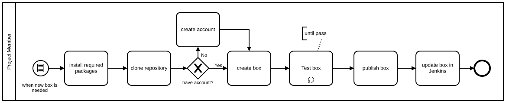

Table of Contents
=================

  * [Table of Contents](#table-of-contents)
  * [Creating and Maintaining Vagrant Boxes](#creating-and-maintaining-vagrant-boxes)
    * [Introduction](#introduction)
    * [The template repository](#the-template-repository)
    * [Creating Vagrant box](#creating-vagrant-box)
      * [Work flow](#work-flow)
      * [Installing required packages](#installing-required-packages)
      * [Cloning the repository](#cloning-the-repository)
      * [Create an account](#create-an-account)
      * [Creating a box](#creating-a-box)
      * [Testing the box](#testing-the-box)
      * [Publishing the new version](#publishing-the-new-version)
      * [Updating boxes in Jenkins slaves](#updating-boxes-in-jenkins-slaves)
    * [Maintaining the repository](#maintaining-the-repository)

# Creating and Maintaining Vagrant Boxes

In role developments, Vagrant is used as a testing environment both in local
machine, and CI server.

## Introduction

Vagrant sets up and configures virtual machines in various platforms, such as
VirtualBox, `qemu`, AWS, Cloudstack, etc. Box is a format for Vagrant
environment, consisting of virtual hard disk, configuration file, and meta
data. Created boxes are used in `ansible-project` and `ansible-role`.

[`packer`](https://www.packer.io/) is a tool to build Vagrant box, developed by
HashiCorp. It reads a JSON file, downloads installation media, launches a
virtual machine, performs installation, runs custom scripts, and creates a
Vagrant box.  A JSON file may contain multiple provider settings, such as
`virtualbox-iso` and `qemu`, enabling to create multiple box files for multiple
providers.

Public boxes available on the Internet, such as `bento` developed by chef, will
not be used in project and role developments. Instead, a template repository is
forked and maintained, and images are created from the files that we maintain.
Instead of `wget -O - http://example.org/install_foo.sh | sudo sh -`, now
people get used to run arbitrary virtual machines, containers, or whatever
images. As you do not install random packages originated from unknown sources,
you should use authoritative images or images that you _own_.

This document describes how you maintain the repository and create Vagrant
boxes.

## The template repository

[reallyenglish/packer-templates](https://github.com/reallyenglish/packer-templates)
is the repository that keeps templates for our images, forked from
[kaorimatz/packer-templates](https://github.com/kaorimatz/packer-templates).
There are many `packer-templates` repositories, but, their target is specific
Linux distributions and providers.

The default branch is `reallyenglish-master`, not `master`. The `master` branch
should be identical to the `master` of the upstream. Our custom modifications
should go into `reallyenglish-master`. You must NOT commit local modifications
to `master` or merge them into `master`. `master` should only be updated with
upstream changes.

Modifications are:

* Install recent `ansible`so that `ansible` will not be installed during
  `kitchen test` to make test faster
* Install `rsync` to make tests faster (the default transport is too slow and
  the upstream has [no plan to fix it](https://github.com/test-kitchen/test-kitchen/pull/845#issuecomment-171524829))
* Other changes necessary in tests environment, such as disabling auto-update

For detailed changes, see `git diff master`.

If your change is not specific to our environment, i.e. adding new version of a
platform, you should submit a PR to the upstream.

## Creating Vagrant box

### Work flow



### Installing required packages

The following packages must be installed on your local machines.

* Vagrant ([download](https://www.vagrantup.com/downloads.html))
* Packer ([download](https://www.packer.io/downloads.html))
* VirtualBox ([download](https://www.virtualbox.org/wiki/Downloads))

### Cloning the repository

Clone the repository in your local machine.

```sh
git clone git@github.com:reallyenglish/packer-templates.git
cd packer-templates
```

### Create an account

Create an account at
[https://atlas.hashicorp.com/vagrant](https://atlas.hashicorp.com/vagrant) to
publish boxes.

### Creating a box

To create Debian image, run:

```sh
packer build -only=virtualbox-iso debian-8.7-amd64.json
```

`packer` will download installation media, launch a VM, perform installation,
and run custom scripts. Obviously, you need a fat pipe and enough disk space.

You may customize variables in the JSON file, such as `{{user ``mirror``}}`to
specify the nearest mirror.

```sh
packer build -only=virtualbox-iso -var 'mirror=http://shadow.ind.ntou.edu.tw/debian-cd/' debian-8.7-amd64.json
```

The customizations with variables should be limited to the image creation
process, and MUST NOT affects the behaviour of the image. The installation
media must be authoritative one from original sources or official mirrors.

For the format of JSON file, see [Packer Documentation](https://www.packer.io/docs/).

The result is usually named in the form of `$NAME-$PLATFORM.box`. See
`post-processors` section in JSON file.

### Testing the box

The box you have created can be locally imported by:

```sh
vagrant box add -f --name trombik/test-debian-8.7-amd64 ./debian-8.7-amd64-virtualbox.box
```

Choose some `ansible-role`, replace box name in `.kitchen.yml` with
the name of the test box, and run `kitchen test`. Make sure:

* `kitchen` does not install `ansible` because it should have been installed by the previous process
* The transport is`rsync`
* `kitchen test` successfully finishes

When the test succeeds, revert the change to the role.

TODO automate the test process

### Publishing the new version

You now have the new version to upload to [a service](https://atlas.hashicorp.com/vagrant),
namely Vagrant Enterprise run by HashiCorp, to distribute boxes.

As the service does not support organizations, like Github does, the current
central box repository for reallyenglish is one of the employees. An account
can give access rights to other Project Members. You must not give access
rights to non-Project Members.

Create an account, if you have not yet, at https://atlas.hashicorp.com/

Tell your account name and ask the account owner to share access to the box you
have created. Then, you can upload the box. See [About Vagrant Boxes](https://atlas.hashicorp.com/help/vagrant/boxes)
for more information.

When the new version has been uploaded, announce the release. All Project
Members should use the same released version.

### Updating boxes in Jenkins slaves

TBW

## Maintaining the repository

TBW
