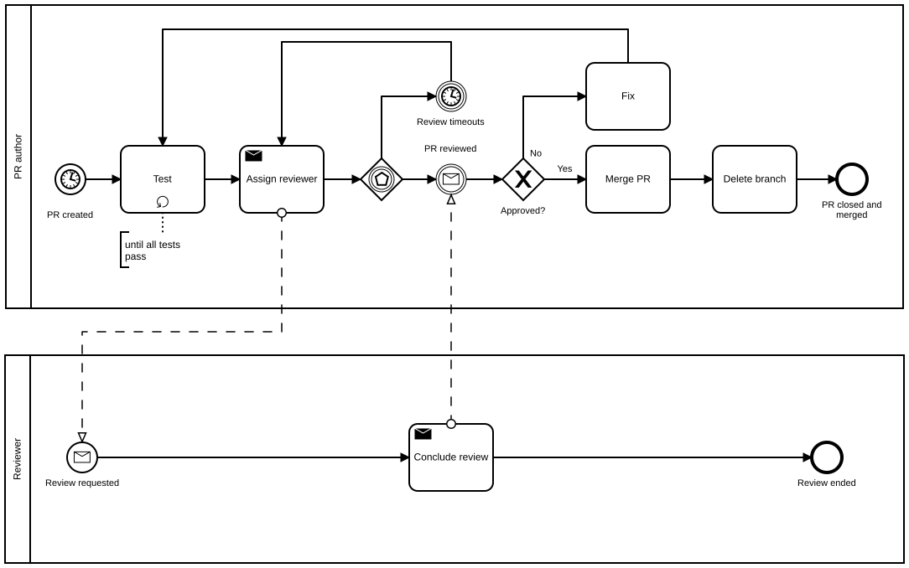

Table of Contents
=================

  * [Table of Contents](#table-of-contents)
  * [Reviewing Pull Request](#reviewing-pull-request)
    * [When to review](#when-to-review)
    * [What to review](#what-to-review)
      * [Documentation](#documentation)
      * [Code](#code)
      * [Conclude the review](#conclude-the-review)

# Reviewing Pull Request

This document describes the procedure to review PR. Review in the discussion
here is _reviewing_ code and its documentation. The scope of the review is role
and project development. There are many review processes in development phases,
but the document describes the procedure to review PRs in role and project
development.

Although reviewing is always subjective, use this document as a checklist when
reviewing PR.

## Overview

## What to review

### Documentation

Documentation is as much important as code is. Here is some key points to
review:

* Are all variables in `defaults/main.yml` documented in `README.md`? All
  variables MUST be documented.
* Are all variables under `vars/*.yml` documented in `README.md`? All the
  default values MUST be documented.
* Do you understand what comments, or tasks  mean? If not, ask the author. If
  it is not clear to you, neither to someone in the future.
* `Example playbook` is identical to the playbook used for unit tests? The
  example must be a working example. If the playbook has changed, the example
  must be updated.
* If the PR is for a release, does `CHANGELOG.md` document the changes from
  the previous release? A list of `git log --oneline` MUST be there with
  corresponding release name.
* If the PR is for a release, does the new release version follow [the rule](https://github.com/reallyenglish/ansible-role-example/tree/master/docs/Procedures/Releasing#versioning)?

### Code

When reviewing code,

* Does the PR do what it claims? It should not do what it does NOT say unless
  the change is a small fix.
* Does the PR have tests that check the new code? Unlike tests in a simple
  application, testing all the code path in role, or project, development is
  not always practical. However, the code should have at least [unit
  tests](https://github.com/reallyenglish/ansible-role-example/tree/master/docs/Getting_Started/Unit_Test).
* Does the role is reasonably abstracted? When a role is abstracted, and free
  from platforms, A single integration test covers all cases in supported
  platforms. Platform-specific tests should be in unit test, not in integration
  test, where possible.
* Use [`?w=1`](https://github.com/blog/967-github-secrets) for better
  readability.
* Ask questions to understand the context of the change.
* Use in-line comments for comments specific to part of the code.
* Use comment in the PR for comments about the whole PR.
* Prefer reviewing one commit a time
* Do variables have appropriate name? How about functions, methods, file name,
  or test name?

### Conclude the review

After reviewing, conclude your review. The options are: `Comment`, `Reject`, or
`Approve`.

* Do not approve when you have questions. Leave questions as comment, and set
  the review status to `Comment`.
* Do not approve when something `should` or `must` be changed. Approve when you
  agree with the author after the discussion.
* When discussion stacks, ask others for comments.
* Do not approve a PR that breaks tests
* If you are not sure about the context, ask those who know it better in the
  team.
